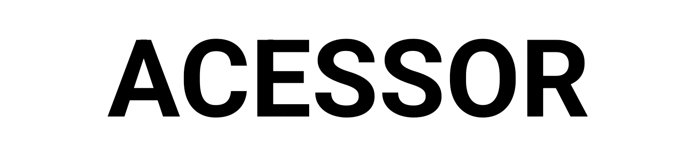

 
 
 ### Hello there! 
 I'm a self-taught programmer and a reverse-engineer from Russia / Belarus. I have 6+ years experience of developing software in C/C++, Java, C#, Web and a few years in cracking and reversing software on various platforms.

	

	
	

    
### My main activities are:

- Reverse-engineering & game modding
- Security research & malware investigation
- Software developement

### Main programming languages:

	

### Contact me:

I'm opened for suggestions! If you want partnership feel free to contact me.

- Discord: <a href="https://discord.com/channels/@me">`@acessor`</a> 
- Telegram: <a href="https://t.me/ac3ss0r">`@ac3ss0r`</a>

